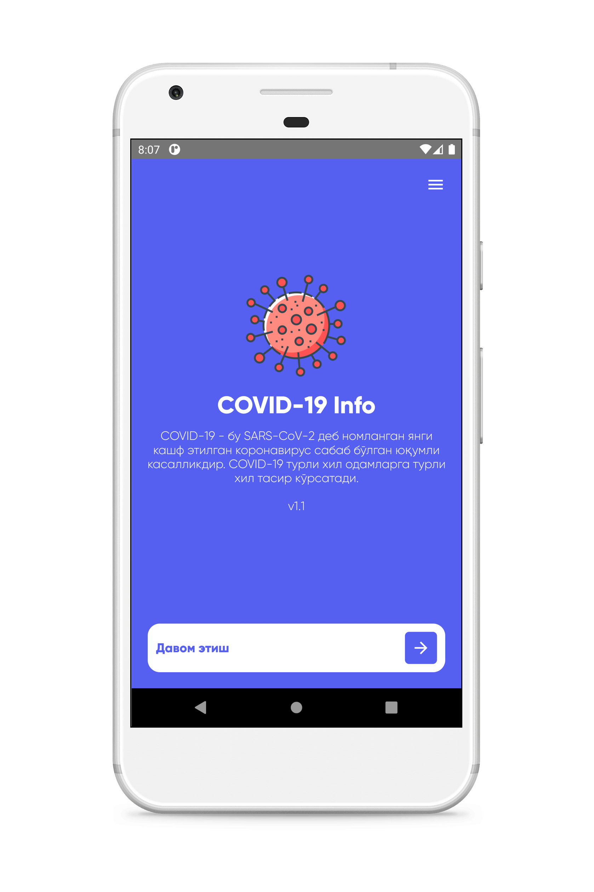
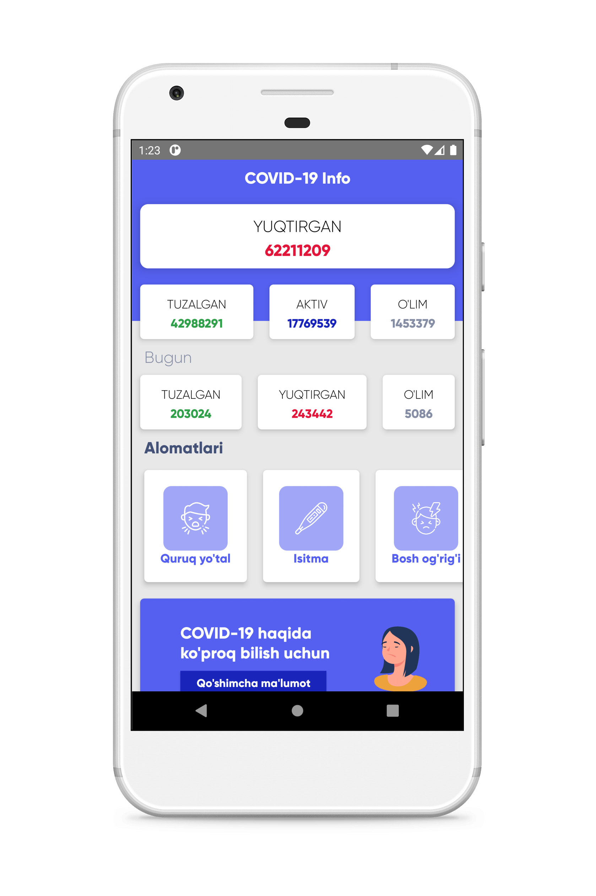
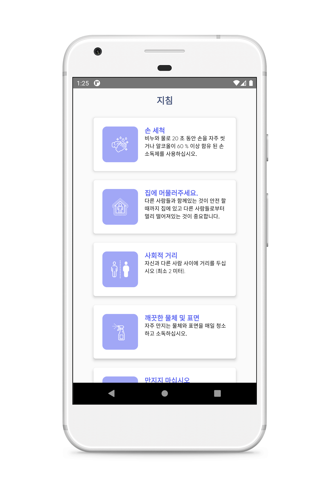
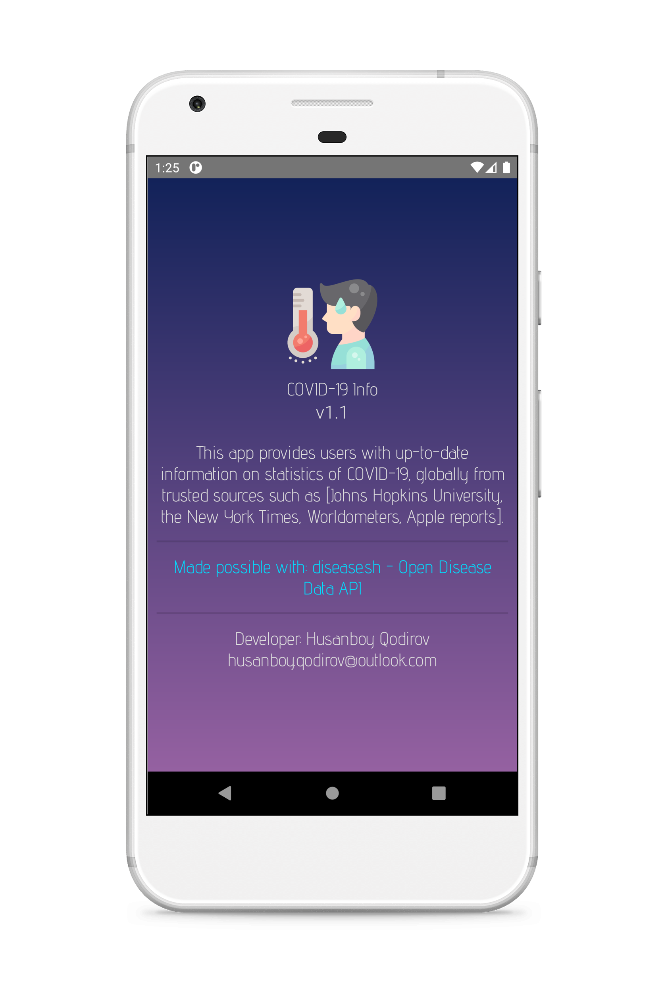

# covid-19_info
Global statistics tracking app for Android.

> ### <a href="https://covid-info.weebly.com/">covid-info.weebly.com</a>

Contiribute by translating the application to other languages or improve existing ones.

Currently supported languages:
* Uzbek (Latin and Cyrillic)
* English
* Korean

<table>
	<th>Language</th>
	<th>Translated by</th>
	<tr>
		<td>English</td>
		<td>
			<a href="https://www.facebook.com/khusanboykodirov">Husanboy Qodirov</a>, 
			<a href="https://www.instagram.com/abbosilyosjonov/">Abbos Ilyosjonov</a>
		</td>
	</tr>
	<tr>
		<td>Korean</td>
		<td>
			<a href="http://facebook.com/hasanboy.dev">Hasanboy Qodirov</a>, 
			<a href="https://www.facebook.com/jakhongir.tukhtasinov.7">Jakhongir Tukhtasinov</a>, 
			<a href="https://www.instagram.com/abbosrakhimov/">Abbosjon Rakhimov</a>
		</td>
	</tr>
	<tr>
		<td>Uzbek (Latin)</td>
		<td>
			<a href="https://www.facebook.com/khusanboykodirov">Husanboy Qodirov</a>, 
			<a href="http://facebook.com/hasanboy.dev">Hasanboy Qodirov</a>, 
			<a href="https://www.facebook.com/otabek.odiljanov.94">Otabek Odiljanov</a>
		</td>
	</tr>
	<tr>
		<td>Uzbek (Cyrillic)</td>
		<td>
			<a href="https://www.instagram.com/alijonov0298/">Abbosbek Alijonov</a>, 
			<a href="https://www.facebook.com/Jakhongir.JMM">Jakhongir Makhammadjonov</a>, 
			<a href="https://www.instagram.com/hamidillomarifjonov/">Hamidillo Marifjonov</a>
		</td>
	</tr>
</table>

<table>
	<tr>
		<td></td>
		<td></td>
	</tr>
	<tr>
		<td></td>
		<td></td>
	</tr>
</table>
